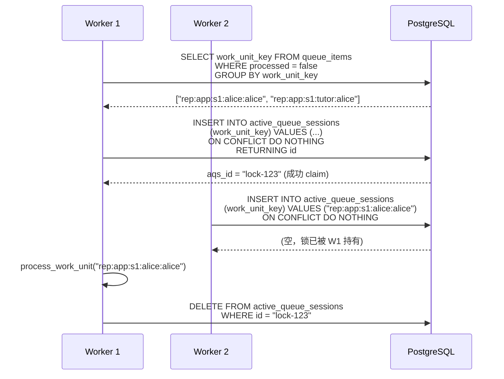
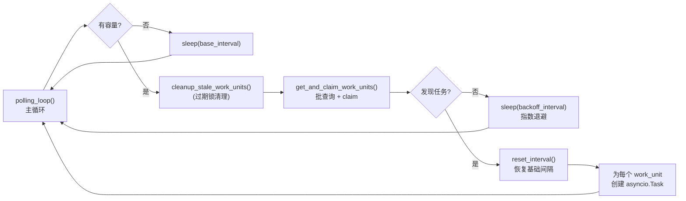
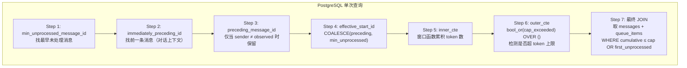
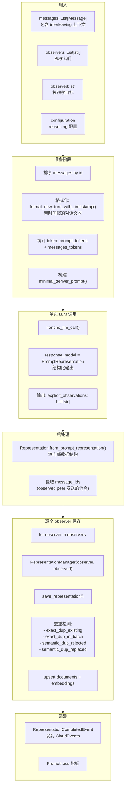
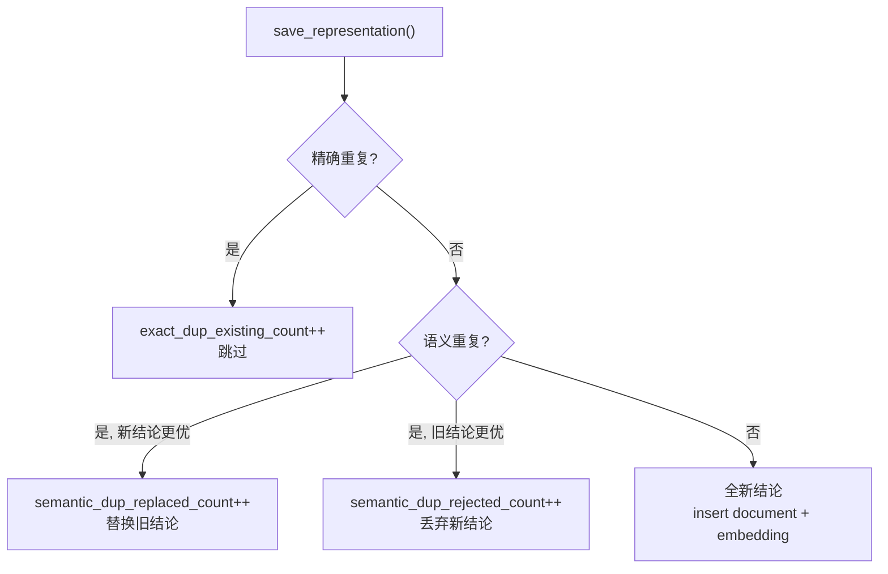
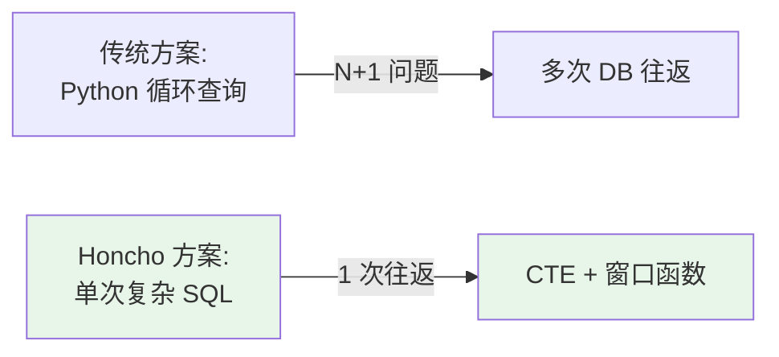

# Honcho Deriver 批处理流程深度解析

> 基于源码 `src/deriver/` 目录（`queue_manager.py`, `consumer.py`, `deriver.py`, `prompts.py`）绘制

---

## 一、整体架构概览

```mermaid
flowchart TB
    subgraph API["API Server (FastAPI)"]
        A1["Messages Router<br/>POST /sessions/{id}/messages"]
        A2["Enqueue<br/>src/deriver/enqueue.py"]
    end

    subgraph DB["PostgreSQL"]
        Q["queue_items 表"]
        AQS["active_queue_sessions 表<br/>(分布式锁)"]
        MSG["messages 表"]
    end

    subgraph Worker["Deriver Worker (独立进程)"]
        QM["QueueManager<br/>polling_loop()"]
        PW["process_work_unit()"]
        GQB["get_queue_item_batch()<br/>(SQL 批查询)"]
        PRB["process_representation_batch()"]
        PRTB["process_representation_tasks_batch()<br/>(minimal deriver)"]
        LLM["honcho_llm_call()<br/>结构化输出"]
        SAVE["RepresentationManager<br/>.save_representation()"]
    end

    subgraph VectorDB["pgvector"]
        COLL["collections<br/>(observer, observed)"]
        DOC["documents<br/>(向量 embedding)"]
    end

    A1 -->|1. 写入| MSG
    A2 -->|2. 入队| Q
    Q -->|3. 轮询发现| QM
    QM -->|4. claim (分布式锁)| AQS
    QM -->|5. 路由| PW
    PW -->|6. 批获取| GQB
    GQB -->|7. SQL 窗口函数| MSG
    GQB -->|8. 返回批| PRB
    PRB -->|9. 处理| PRTB
    PRTB -->|10. 构建 prompt| LLM
    LLM -->|11. 结构化输出| PRTB
    PRTB -->|12. 保存| SAVE
    SAVE -->|13. upsert| COLL
    SAVE -->|14. upsert| DOC
```

---

## 二、队列管理机制（QueueManager）

### 2.1 Work Unit 概念

Honcho 使用 **work_unit_key** 作为任务的逻辑分组标识：

```
work_unit_key = "{task_type}:{workspace_name}:{session_name}:{observer}:{observed}"

示例:
  "representation:my-app:session-1:alice:alice"   ← alice 观察 alice（自我建模）
  "representation:my-app:session-1:tutor:alice"   ← tutor 观察 alice
  "summary:my-app:session-1::"                     ← 会话摘要
  "dream:my-app:::alice"                           ← alice 的 dream 任务
```

### 2.2 分布式锁机制（ActiveQueueSession）



### 2.3 轮询策略



**退避策略参数：**

| 参数 | 默认值 | 说明 |
|------|--------|------|
| `POLLING_SLEEP_INTERVAL_SECONDS` | 1s | 基础轮询间隔 |
| `POLLING_BACKOFF_ENABLED` | true | 是否启用退避 |
| `POLLING_BACKOFF_MULTIPLIER` | 1.5 | 退避乘数 |
| `POLLING_SLEEP_MAX_INTERVAL_SECONDS` | 60s | 最大间隔 |
| `POLLING_JITTER_RATIO` | 0.1 | 抖动比例 (±10%) |
| `STALE_SESSION_TIMEOUT_MINUTES` | 10min | 锁过期时间 |

---

## 三、批获取算法（get_queue_item_batch）

### 3.1 核心 SQL 查询逻辑

这是最复杂的部分，Honcho 用**单个 SQL 查询**完成批获取：



### 3.2 Token 窗口控制

```mermaid
graph LR
    subgraph Window["消息窗口"]
        direction LR
        P["前一条消息<br/>(上下文)"]
        M1["msg_1<br/>待处理"]
        M2["msg_2<br/>待处理"]
        M3["msg_3<br/>待处理"]
        M4["msg_4<br/>累积超 cap"]
        M5["msg_5<br/>被截断"]
    end

    P --> M1 --> M2 --> M3
    M3 -.->|token 累积<br/>超上限| M4
    M4 -.x|不返回| M5

    style M1 fill:#e8f5e9
    style M2 fill:#e8f5e9
    style M3 fill:#e8f5e9
    style M4 fill:#ffebee
    style M5 fill:#ffebee
```

**关键设计：**
- `batch_max_tokens`：单批输入 token 上限（默认约 25K）
- `hit_batch_token_cap`：标记是否因 token 上限截断了更多消息
- `was_flush_enabled`：强制刷新模式（不等待批满，立即处理）

### 3.3 配置同质性过滤

```python
def _resolve_batch_configuration(items):
    """只保留初始同配置前缀"""
    first_config = items[0].payload["configuration"]
    valid_items = []
    for item in items:
        if item.payload["configuration"] != first_config:
            break  # 配置变化，截断批次
        valid_items.append(item)
    return valid_items, first_config
```

---

## 四、Deriver 处理流程（process_representation_tasks_batch）

### 4.1 完整流程图



### 4.2 Prompt 结构（minimal_deriver_prompt）

```
Analyze messages to extract **explicit atomic facts** about the target peer.

[EXPLICIT] DEFINITION: Facts about the target peer that can be derived directly from their messages.
   - Transform statements into one or multiple conclusions
   - Each conclusion must be self-contained with enough context
   - Use absolute dates/times when possible

RULES:
- The target peer is the peer identified below under `Target peer:`.
- A peer can be a human user, AI agent, bot, service, or other actor.
- Use the exact peer id from `Target peer:` in final observations
- Properly attribute observations to the correct subject
- Observations should make sense on their own
- Extract ALL observations from the target peer's messages, using others as context.
- Contextualize each observation sufficiently

EXAMPLES (using `alice` as the target peer id):
- EXPLICIT: "I just had my 25th birthday last Saturday" → "alice is 25 years old", "alice's birthday is June 21st"
- EXPLICIT: "I took my dog for a walk in NYC" → "alice has a dog", "alice lives in NYC"

[CUSTOM INSTRUCTIONS (optional)]

Target peer:
{peer_id}

Messages to analyze:
<messages>
{formatted_messages}
</messages>
```

**关键特点：**
- **单次 LLM 调用**（minimal deriver），非工具循环
- **结构化输出**（`PromptRepresentation`）：只输出 `explicit` 结论列表
- **无 deductive/inductive**：这些留给 Dreamer 做

### 4.3 结构化输出模型

```python
class PromptRepresentation(BaseModel):
    explicit: list[ExplicitObservationBase]
    # 注意：Deriver 只产出 explicit，没有 deductive/inductive/contradiction

class ExplicitObservationBase(BaseModel):
    content: str  # 原子事实文本
```

### 4.4 保存时的去重逻辑



---

## 五、时序图：完整批处理生命周期

```mermaid
sequenceDiagram
    autonumber
    participant Client
    participant API as API Server
    participant PG as PostgreSQL
    participant QM as QueueManager<br/>(Worker)
    participant Deriver
    participant LLM as LLM Provider
    participant VS as pgvector

    %% 写入阶段
    Client->>API: POST /sessions/s1/messages<br/>[alice: "我喜欢网球", tutor: "太好了"]
    API->>PG: INSERT INTO messages (...)
    API->>PG: INSERT INTO message_embeddings<br/>(sync_state='pending')
    API->>PG: INSERT INTO queue_items<br/>(work_unit_key="rep:app:s1:alice:alice",<br/>task_type="representation")
    API-->>Client: 201 Created

    %% 轮询阶段
    loop polling_loop (每 1s)
        QM->>PG: SELECT work_unit_key FROM queue_items<br/>WHERE processed = false<br/>GROUP BY work_unit_key
        PG-->>QM: ["rep:app:s1:alice:alice"]

        QM->>PG: INSERT INTO active_queue_sessions<br/>ON CONFLICT DO NOTHING<br/>RETURNING id
        PG-->>QM: aqs_id = "lock-abc"
    end

    %% 批获取阶段
    QM->>PG: get_queue_item_batch()<br/>复杂 SQL 窗口查询
    Note over PG: Step 1: 找最早未处理消息<br/>Step 2: 累积 token 到上限<br/>Step 3: 返回 messages + queue_items
    PG-->>QM: messages: [alice_msg, tutor_msg]<br/>queue_items: [qi_1, qi_2]

    %% Deriver 处理阶段
    QM->>Deriver: process_representation_tasks_batch(
      messages, observers=["alice"], observed="alice", ...)

    Deriver->>Deriver: format messages with timestamps
    Deriver->>Deriver: build minimal_deriver_prompt()

    Deriver->>LLM: honcho_llm_call(<br/>prompt=...,<br/>response_model=PromptRepresentation,<br/>json_mode=True)
    LLM-->>Deriver: {explicit: ["alice likes tennis"]}

    Deriver->>Deriver: convert to Representation
    Note over Deriver: from_prompt_representation()<br/>附加 metadata (message_ids, session_name, created_at)

    %% 保存阶段
    Deriver->>PG: RepresentationManager(observer="alice", observed="alice")
    Deriver->>PG: save_representation()
    Note over PG: 去重检测<br/>insert/update documents<br/>upsert embedding 向量
    PG-->>Deriver: result (dup counts)

    Deriver->>PG: UPDATE queue_items SET processed = true<br/>WHERE id IN (...)
    Deriver->>PG: DELETE FROM active_queue_sessions<br/>WHERE id = "lock-abc"

    %% 遥测
    Deriver->>PG: emit RepresentationCompletedEvent
```

---

## 六、关键设计决策

### 6.1 为什么用单次 LLM 调用？

| 方案 | 延迟 | 成本 | 复杂度 | Honcho 选择 |
|------|------|------|--------|------------|
| Agent 工具循环 | 高 | 高 | 高 | ❌ |
| 单次结构化输出 | 低 | 低 | 低 | ✅ |

Honcho 称为 **"minimal deriver"** —— 用可预测性和低成本换取灵活性。复杂的推理留给 Dreamer。

### 6.2 为什么用 SQL 窗口函数做批获取？



Honcho 的 `get_queue_item_batch()` 用**一个 SQL 查询**完成：
1. 找最早未处理消息
2. 累积 token 到上限
3. 检测是否超 cap
4. 返回 messages + queue_items

### 6.3 为什么 observers 是列表？

```python
observers = ["alice", "tutor"]  # 多个观察者
observed = "alice"               # 被观察目标
```

同一份结论可以同时写入多个 collection：
- `(alice, alice)` — alice 的自我认知
- `(tutor, alice)` — tutor 对 alice 的认知

**单次 LLM 调用，多次保存**，摊薄成本。

---

## 七、与 Mem0 add() 的对比

| 维度 | **Honcho Deriver** | **Mem0 add()** |
|------|-------------------|----------------|
| **触发时机** | 异步（消息入队后） | 同步（调用即处理） |
| **批处理** | ✅ 按 session 累积批处理 | ❌ 单条处理 |
| **Token 控制** | ✅ SQL 窗口函数精确控制 | ❌ 无内置批累积 |
| **LLM 调用次数** | 每批 1 次（摊薄 N 条消息） | 每次 add 1 次 |
| **去重** | ✅ 精确 + 语义去重 | ✅ 哈希去重 |
| **输出格式** | 结构化 `explicit` 列表 | 自由文本记忆 |
| **多视角** | ✅ 同结论写入多个 observer | ❌ 单 user_id |
| **架构复杂度** | 高（Worker + Queue + SQL） | 低（同步调用） |

---

## 八、对 SeptMuse 的启示

### 可借鉴的设计

1. **Work Unit 队列模型**：用 `(task_type, scope, target)` 做分组，天然支持多 observer
2. **SQL 窗口函数批获取**：单次查询搞定 token 累积 + 上下文拼接 + cap 检测
3. **ActiveQueueSession 分布式锁**：PostgreSQL `ON CONFLICT DO NOTHING` 实现无外部依赖的锁
4. **单次结构化 LLM 调用**：Deriver 只做 explicit 抽取，复杂推理留给下游
5. **逐 observer 保存 + 去重**：同结论多视角存储，摊薄 LLM 成本

### 需要权衡的取舍

- Honcho 的 Deriver **不做 deductive/inductive**，这些靠 Dreamer 补充。SeptMuse 如果走同步路线，可能需要在 `add()` 内做更多推理
- Honcho 的批处理延迟由 `REPRESENTATION_BATCH_MAX_AGE_SECONDS` 控制（默认几秒到几分钟），SeptMuse 若保持同步则无此延迟

---

*报告完*
