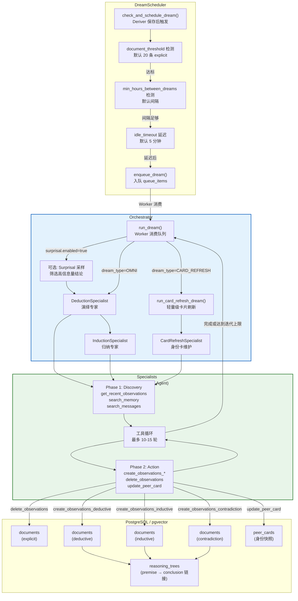
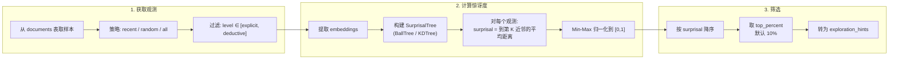
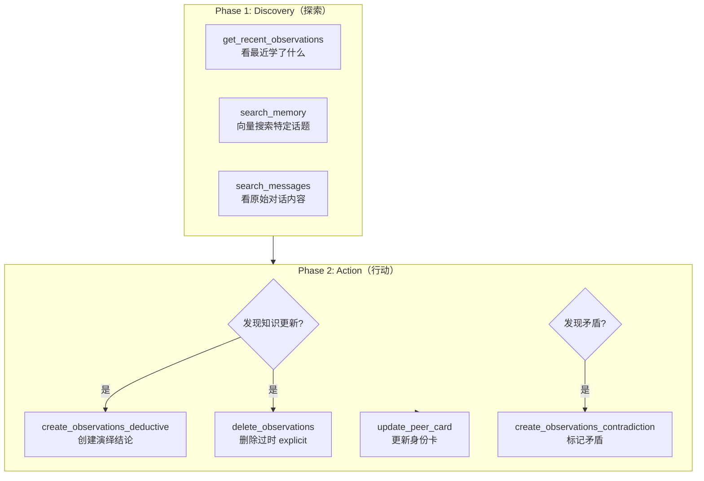
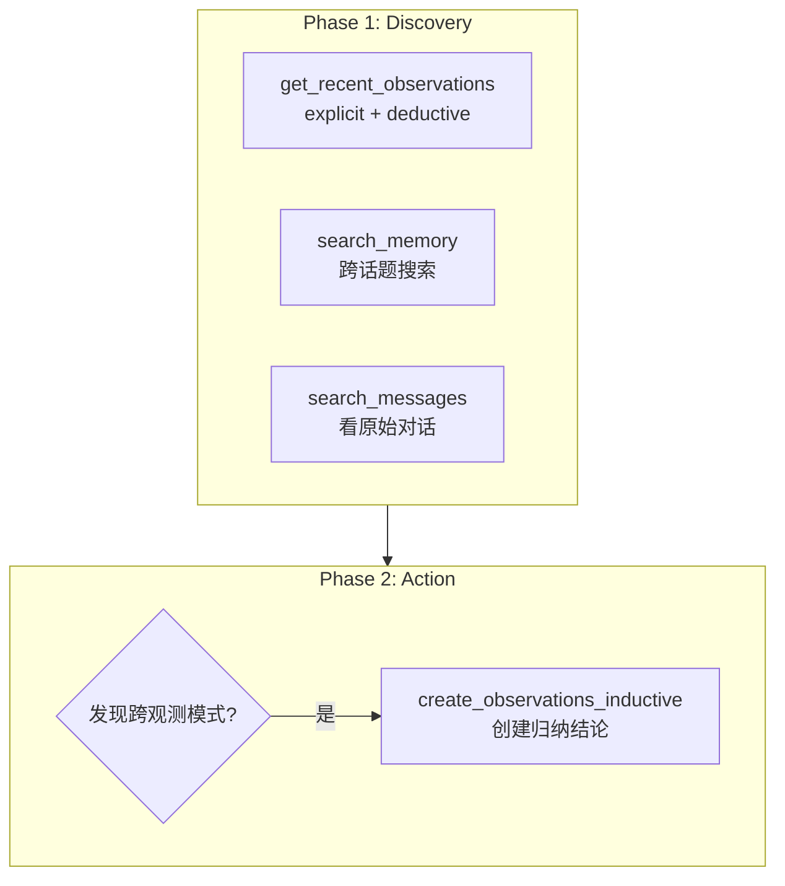
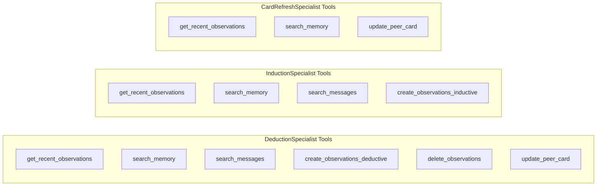
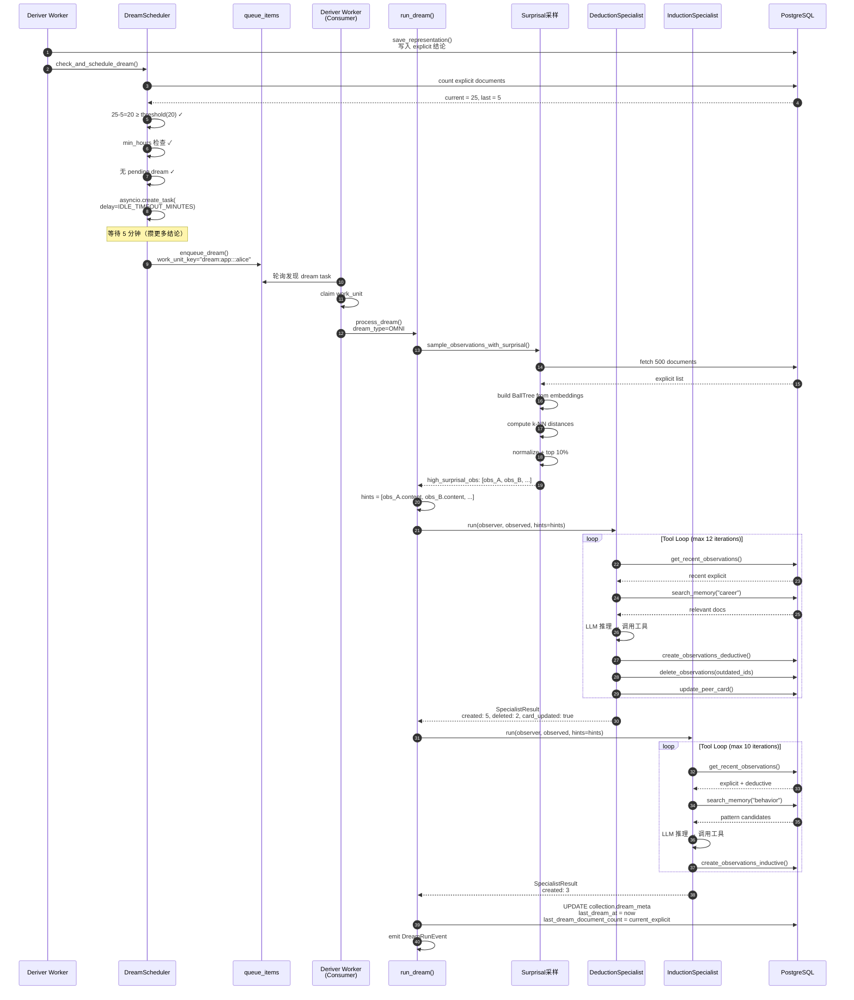
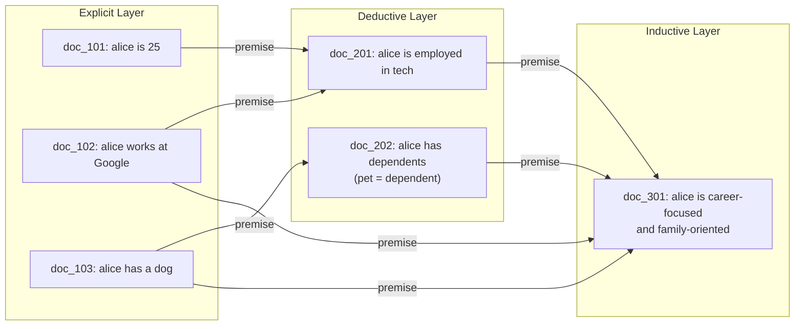
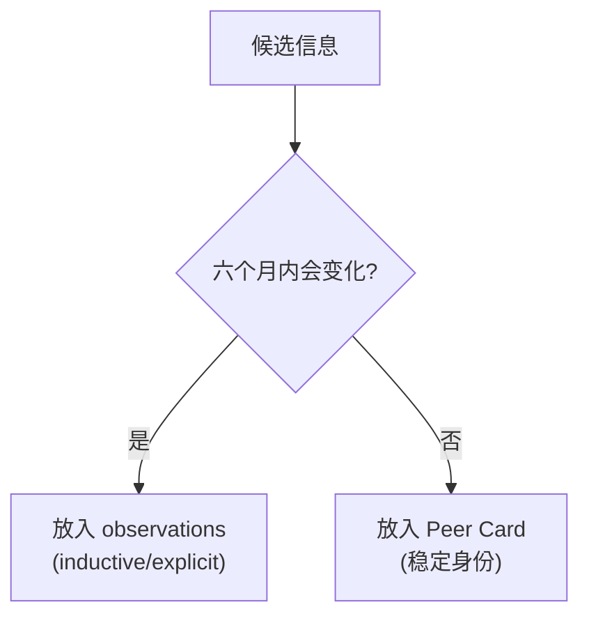
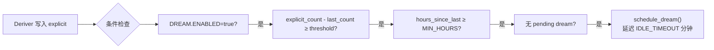
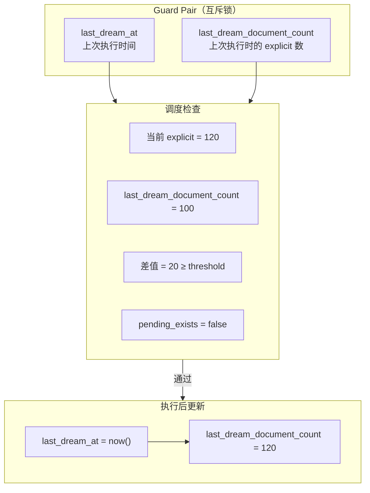

# Honcho Dreamer 推理整合流程深度解析

> 基于源码 `src/dreamer/` 目录（`orchestrator.py`, `specialists.py`, `surprisal.py`, `dream_scheduler.py`）绘制

---

## 一、Dreamer 定位与核心思想

**Dreamer 是 Honcho 的"夜间整理师"** —— 当 Deriver 生成大量原始 explicit 结论后，Dreamer 负责：

1. **Deduction**（演绎）：从 explicit 推导隐含逻辑（"在 Google 做 SWE" → "有软件工程技能"）
2. **Induction**（归纳）：从多个事实中提炼模式（"周一迟到、周二迟到" → "倾向于迟到"）
3. **Peer Card 维护**：更新稳定的身份快照
4. **Contradiction 检测**：标记矛盾陈述

**核心设计哲学：**
> Deriver 做"快思考"（单次 LLM 调用，事实抽取），Dreamer 做"慢思考"（多轮 Agent 工具循环，深度推理）。

---

## 二、整体架构：Orchestrator + Specialists



---

## 三、Surprisal（惊讶度）采样机制

### 3.1 为什么需要 Surprisal？

Deriver 源源不断地产生 explicit 结论（可能数百条），Dreamer 不可能每次都处理全部。**Surprisal 采样选出"最出人意料"的结论**，让 Dreamer 聚焦高价值信息。

### 3.2 Surprisal 计算流程



### 3.3 几何直觉

```
高维向量空间中:

  ● 普通结论（邻居密集）          ● 出人意料结论（邻居稀疏）
  ↓ surprisal 低                  ↓ surprisal 高

     ● ● ●
    ● ●A● ●        A 的 5-NN 距离小        ●
     ● ● ●                              ●   B
                                        ●
                                          ●
                                        B 的 5-NN 距离大 → 高 surprisal
```

**数学定义：**
```python
surprisal(embedding) = mean_distance_to_k_nearest_neighbors(embedding, k=TREE_K)
```

### 3.4 采样策略配置

| 配置项 | 默认值 | 说明 |
|--------|--------|------|
| `SAMPLING_STRATEGY` | `recent` | 采样策略：`recent` / `random` / `all` |
| `SAMPLE_SIZE` | 500 | 最大采样数 |
| `TREE_TYPE` | `balltree` | 树结构：`balltree` / `kdtree` |
| `TREE_K` | 5 | K 近邻数 |
| `TOP_PERCENT_SURPRISAL` | 0.1 | 取 top 10% |
| `INCLUDE_LEVELS` | `["explicit", "deductive"]` | 参与计算的结论层级 |

---

## 四、Specialist 工具循环详解

### 4.1 三种 Specialist 对比

| 维度 | **DeductionSpecialist** | **InductionSpecialist** | **CardRefreshSpecialist** |
|------|------------------------|------------------------|--------------------------|
| **目标** | 逻辑推导 + 清理过时结论 | 模式归纳 + 行为洞察 | 维护 Peer Card 身份快照 |
| **可写结论类型** | deductive + contradiction | inductive | 无（只更新 peer_card） |
| **可删结论** | ✅ 可以删除过时 explicit | ❌ 不删除 | ❌ 不删除 |
| **可更新 Peer Card** | ✅ | ❌ | ✅ |
| **最大迭代** | 12 | 10 | 6 |
| **模型配置** | `DREAM.DEDUCTION_MODEL_CONFIG` | `DREAM.INDUCTION_MODEL_CONFIG` | 复用 DEDUCTION |

### 4.2 DeductionSpecialist 的两阶段工作流



**Deduction 的典型产出：**

```python
# 输入 explicit:
#   "alice works as SWE at Google"
#   "alice has 5 years of experience"

# 输出 deductive:
DeductiveObservation(
    conclusion="alice has software engineering skills",
    premises=["alice works as SWE at Google", "alice has 5 years of experience"],
    source_ids=["doc_123", "doc_124"],
)

# 知识更新场景:
#   旧 explicit: "alice lives in NYC"
#   新 explicit: "alice moved to SF last month"
# → 创建 deductive: "alice lives in SF"
# → 删除旧 explicit (标记过时)
```

### 4.3 InductionSpecialist 的两阶段工作流



**Induction 的典型产出：**

```python
# 输入多个 explicit:
#   "alice rescheduled Monday's meeting"
#   "alice rescheduled Tuesday's meeting"
#   "alice said she was stressed about deadlines"

# 输出 inductive:
InductiveObservation(
    conclusion="alice tends to reschedule meetings when under deadline pressure",
    sources=["alice rescheduled Monday...", "alice rescheduled Tuesday...", "alice said she was stressed..."],
    source_ids=["doc_1", "doc_2", "doc_3"],
    pattern_type="behavior",
    confidence="medium",  # 3-4 条证据
)
```

### 4.4 工具集对比



---

## 五、完整的 Dream 生命周期时序图



---

## 六、推理树（Reasoning Trees）

### 6.1 数据模型



### 6.2 reasoning_trees 表结构

```sql
-- 推理树记录每条结论的来源
CREATE TABLE reasoning_trees (
    id TEXT PRIMARY KEY,
    workspace_name TEXT NOT NULL,
    observer TEXT NOT NULL,
    observed TEXT NOT NULL,
    conclusion_document_id TEXT NOT NULL,    -- 当前结论 doc_id
    premise_document_id TEXT NOT NULL,        -- 前提 doc_id
    created_at TIMESTAMP DEFAULT NOW()
);
```

**用途：**
- `get_reasoning_chain(doc_id)` — 回溯一条结论的完整推理链
- 可解释性：Dialectic 回答时可以展示"为什么我知道这个"
- 置信度评估：链条越长/分支越多，结论越可靠

---

## 七、Peer Card 身份快照

### 7.1 四条严格格式规则

Peer Card 是**稳定身份标记的快照**，不是动态观察：

| 前缀 | 类型 | 示例 |
|------|------|------|
| `IDENTITY:` | 标识信息 | `IDENTITY: Name: Alice` |
| `ATTRIBUTE:` | 稳定属性 | `ATTRIBUTE: Location: NYC` |
| `RELATIONSHIP:` | 持久关系 | `RELATIONSHIP: Spouse: Bob` |
| `INSTRUCTION:` | 交互规则 | `INSTRUCTION: Call me Vee` |

### 7.2 稳定性规则

> **"如果值在六个月内可能变化（没有明确公告），就不属于 Peer Card。"**



### 7.3 Card Refresh 的两种模式

| 模式 | 触发条件 | 行为 |
|------|----------|------|
| **Refresh** | 默认 | 读取现有 card + 新观测 → 增量更新 |
| **Rebuild** | 大量删除后 | 不读现有 card → 从观测完全重建 |

---

## 八、Dream 调度策略

### 8.1 触发条件（与门逻辑）



### 8.2 配置参数

| 参数 | 默认值 | 说明 |
|------|--------|------|
| `DREAM.ENABLED` | true | 总开关 |
| `DOCUMENT_THRESHOLD` | 20 | 自上次 dream 新增的 explicit 数阈值 |
| `MIN_HOURS_BETWEEN_DREAMS` | 1 | 两次 dream 最小间隔 |
| `IDLE_TIMEOUT_MINUTES` | 5 | 达标后延迟多久执行（攒更多结论） |
| `ENABLED_TYPES` | `["omni", "card_refresh"]` | 启用的 dream 类型 |

### 8.3 防重复机制



---

## 九、与 Mem0 的架构对比

| 维度 | **Honcho Dreamer** | **Mem0** |
|------|-------------------|----------|
| **推理时机** | 异步批处理（攒够阈值后触发） | 同步（add() 时立即处理） |
| **推理 Agent** | 多 Specialist 工具循环（Deduction + Induction） | 单次 LLM 调用（fact extraction） |
| **结论分层** | explicit → deductive → inductive | 单层 facts |
| **推理链** | ✅ 显式追踪（reasoning_trees） | ❌ 隐式（linked_memory_ids） |
| **用户画像** | ✅ Peer Card（稳定身份快照） | ❌ 无 |
| **矛盾处理** | ✅ 显式 contradiction 结论 | ❌ 依赖后续 add 覆盖 |
| **模式发现** | ✅ InductionSpecialist 自动归纳 | ❌ 无自动归纳 |
| **惊喜度驱动** | ✅ Surprisal 采样聚焦高价值 | ❌ 无 |
| **成本** | 高（多轮 Agent + 延迟处理） | 低（单次调用 + 立即返回） |

---

## 十、对 SeptMuse 的启示

### 10.1 可借鉴的架构模式

| 模式 | SeptMuse 现状 | 建议 |
|------|--------------|------|
| **多层推理** | `TripletExtractor` 抽三元组 | 增加 Deduction/Induction 分层，显式记录推理链 |
| **Surprisal 采样** | 无 | 用 K-NN 距离筛选高价值记忆，减少 LLM 调用量 |
| **Peer Card** | 无 | 为每个 user 维护稳定身份快照，注入 Dialectic prompt |
| **异步 Dream** | 全同步 | 可选后台 worker，攒批后深度推理 |
| **工具循环 Agent** | 无 | Dialectic/Reflect 可用工具循环替代单次调用 |

### 10.2 实现优先级建议

```
Phase 1（轻量版）:
  └─ 在 add() 后异步触发一次"轻量 Deduction"
  └─ 用简单的规则（关键词匹配）做 implicit implication

Phase 2（完整版）:
  └─ 引入 Worker + Queue 架构
  └─ 实现 DeductionSpecialist（工具循环）
  └─ 引入 reasoning_trees 表

Phase 3（高级版）:
  └─ InductionSpecialist（模式归纳）
  └─ Surprisal 采样
  └─ Peer Card 维护
```

---

*报告完*
